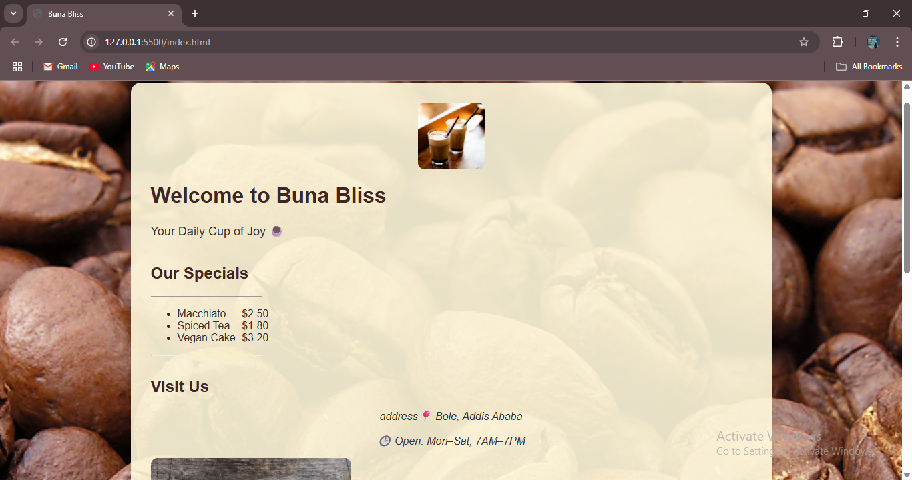

# ☕ Coffee Landing Page

A simple, beginner-friendly landing page built using only **HTML** and **basic CSS** as part of my web development journey. This project is based on concepts learned from [freeCodeCamp's Basic CSS curriculum](https://www.freecodecamp.org/).

---

## 🌟 Features

- Eye-catching **coffee-themed hero section**
- Dual image design: **background image** and **separate product image**
- Clean **text layout and alignment**
- Fully **responsive on small devices**
- Real-world application: great for showcasing a café, product, or landing page idea

---

## 🛠️ Tools Used

- HTML5
- Basic CSS (colors, fonts, margins, padding, background image, box model, flexbox)

---

## 📸 Preview



---

## 🔧 Project Requirements

**As the client, I requested the following:**

- 🎨 Theme: Coffee color palette (#4B2E2E, beige, and white)
- 🖼️ Dual imagery:
  - Background: high-quality coffee ambiance image
  - Body: coffee cup or product image
- ✍️ Fonts: Clean and readable (like `sans-serif`)
- 📐 Layout:
  - Centered heading & description
  - CTA button styled and aligned
  - Mobile-friendly layout
- 🌍 Footer with social icons (static)

---

## 🚀 Getting Started

To view or edit this project:

1. Clone the repo  
   ```bash
   git clone https://github.com/kal1kidan/coffee-landing-page.git
